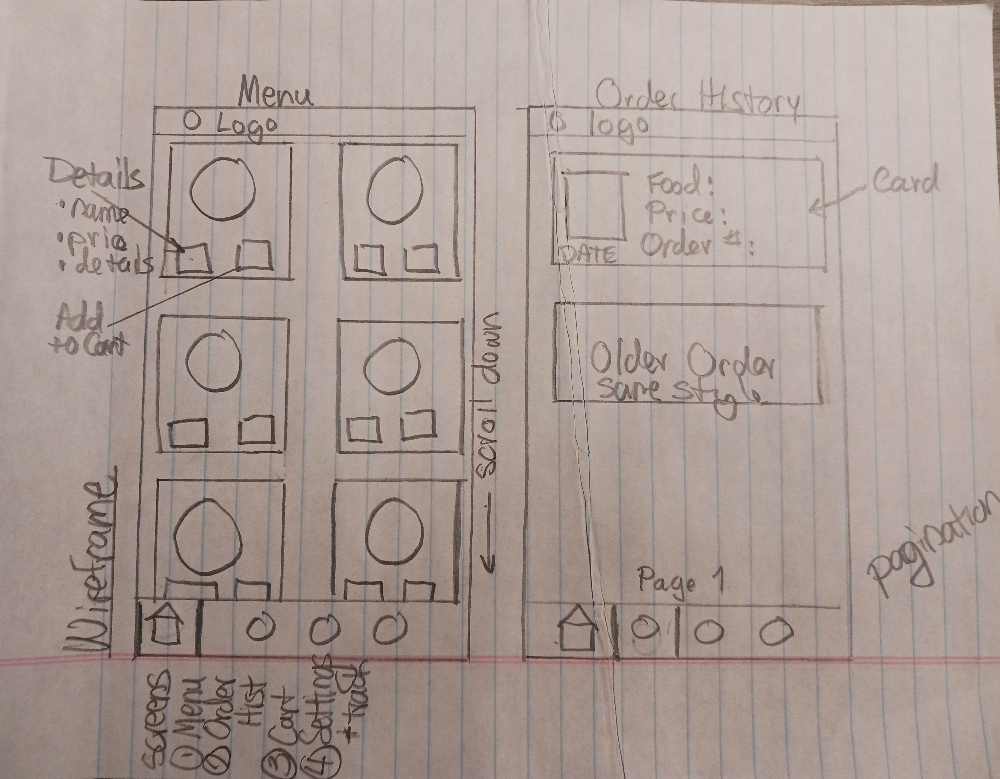
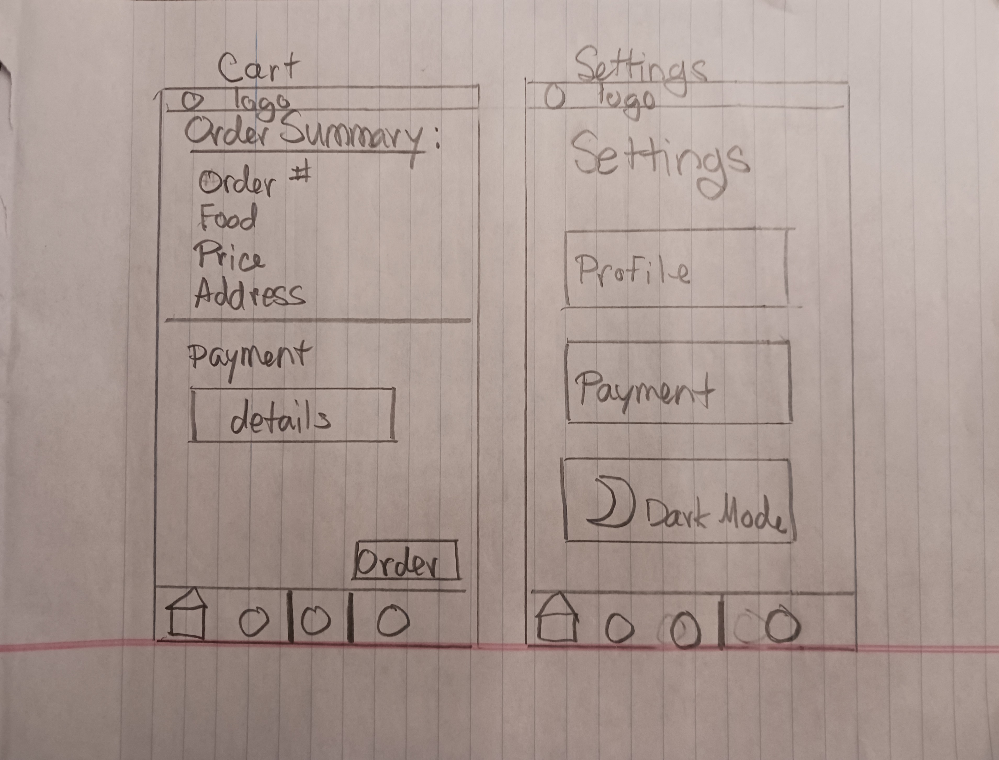
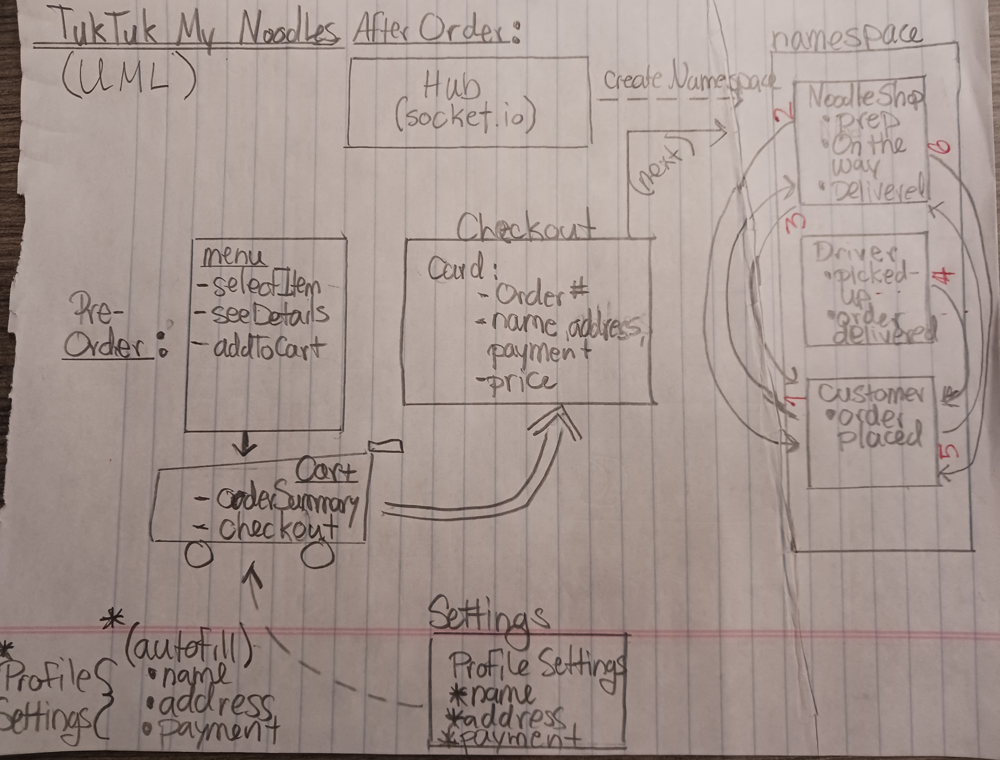

# noodleShop

# 🍜 TukTuk My Noodles

**TukTuk My Noodles** is a mobile-friendly app that lets users browse, learn about, and order Thai noodle dishes from a restaurant’s menu.  
Users can view photos, read dish descriptions, add items to their cart, and check out — all in a clean, intuitive interface.

---

## 🧩 Overview

This app is designed to make it simple and fun to explore authentic Thai noodle dishes.  
Built with **React Native** and **Expo**, it’s optimized for both Android and iOS devices.

---

## 👥 User Stories

- As a user, I want to **browse a list of noodle dishes** with names and pictures.  
- As a user, I want to **tap a dish to see its description and price**.  
- As a user, I want to **add items to my cart** and view or remove them before checkout.  
- As a user, I want the interface to feel **smooth, colorful, and easy to use** on mobile devices.  
- As a user, I want to be able to add my name, address, and payment info into a **profile to be used at checkout**.
- As a user, I want to **switch to dark mode**.

---

## ✨ Features

✅ Browse Thai noodle dishes with images and descriptions  
✅ Add / remove dishes from cart  
✅ View cart summary before checkout  
✅ Clean, responsive mobile design 
✅ Switch between light and dark mode
✅ Create a delivery profile
✅ Easy navigation between screens (Home, Menu, Cart)  
✅ Future expansion for online ordering or restaurant integration  

---

## 🛠️ Tech Stack

**Frontend:**  
- [React Native](https://reactnative.dev/)  
- [Expo](https://expo.dev/)  
- [JavaScript (ES6+)](https://developer.mozilla.org/en-US/docs/Web/JavaScript)  

**Backend (in development):**  
- [Node.js](https://nodejs.org/)  
- [Express](https://expressjs.com/)  

**Tools & Libraries:**  
- React Navigation  
- Redux Toolkit (for state management)  
- Axios (for API calls)  

---

## ⚙️ Installation & Setup

### Prerequisites
- Node.js (v18+ recommended)  
- Expo CLI  
- Android Studio or Expo Go App (for mobile testing)

### Steps

1. **Clone the repository:**
   ```bash
   git clone https://github.com/yourusername/tuktuk-my-noodles.git
   cd tuktuk-my-noodles

2. Install dependencies:
npm install

3. Start the development server:
npx expo start

4. Run the app:
    📱 On *Android*: Scan the QR code in Expo Go
    🍏 On *iOS*: Use Expo Go or the iOS simulator

🧠 **UML Diagram & Wireframe**




### 💡 Use Case
**Use this app to:**
- Explore Thai noodle dishes visually and interactively
- Serve as a digital restaurant menu
- Demonstrate mobile UI/UX design skills using React Native

### 📌 Future Improvements
* Integrate backend ordering system
* Add user authentication and order history
* Include restaurant location and contact info
* Add payment gateway integration
* Splash screen for tracking order
* Add communication ability between driver, customer, and restaurant
* Add spicy level to ordered dishes

### ♿ Accessibility Focus
* This app aims to ensure usability for visually impaired users by:
* Supporting Dark Mode and high-contrast themes
* Using clear typography and large touch targets
* Including labels for assistive technologies (e.g., screen readers)
* Maintaining logical navigation structure and readable color contrasts

### 🆕 Update Log
* User Story 4 — Profile & Dark Mode (October 2025)
* Added Settings Screen where users can:
* Create, edit, and save profile information (e.g., name, email, preferences).
* Toggle Dark Mode on/off using a switch that instantly updates the app theme.
* Integrated Context API to manage global Dark Mode and profile state across screens.
* Updated HomeScreen to dynamically reflect dark or light mode themes.
* Enhanced accessibility with improved color contrast, consistent font sizes, and better readability for visually impaired users.
* Optimized layout for smooth navigation and responsive styling on various devices.

#### 👨‍💻 Author
**Jason Timm**
React Native Developer | Educator | App Creator


